专题页面性能分析
==================

wifi网络环境1--页面加载时间
--------------
1. [专题1](http://mst.vip.com/356726.php)

   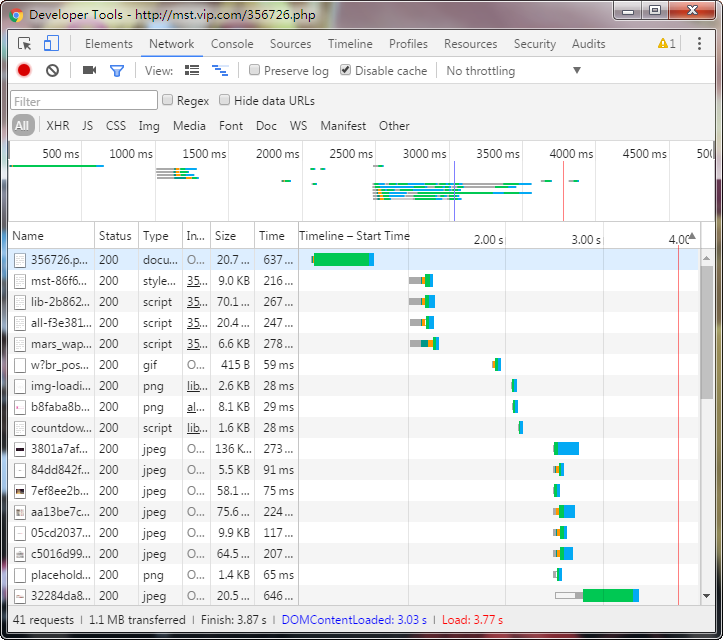

   禁用浏览器缓存 首屏首次访问，DOMContentLoaded, Load事件的时间见图，首字节时间 567ms

2. [专题2](http://mst.vip.com/359326.php)

   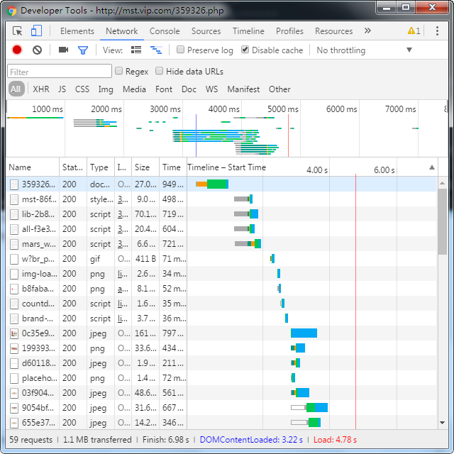

   禁用浏览器缓存 首屏首次访问，DOMContentLoaded, Load事件的时间见图，首字节时间 559ms

3. [京东类专题页](http://sale.jd.com/m/act/kmRjHY1UNoPAagbL.html?share=yes&jd_pop=5f92bec2-c4df-49a4-8692-8cf3a6cc6419&abt=1)

   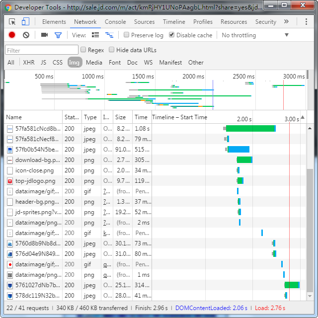

   禁用浏览器缓存 首屏首次访问，DOMContentLoaded, Load事件的时间见图，首字节时间 26ms

4. [淘宝类专题页](https://market.m.taobao.com/apps/mchi/mchi/index?spm=a1z5n.7782591.categorylist.1)   

   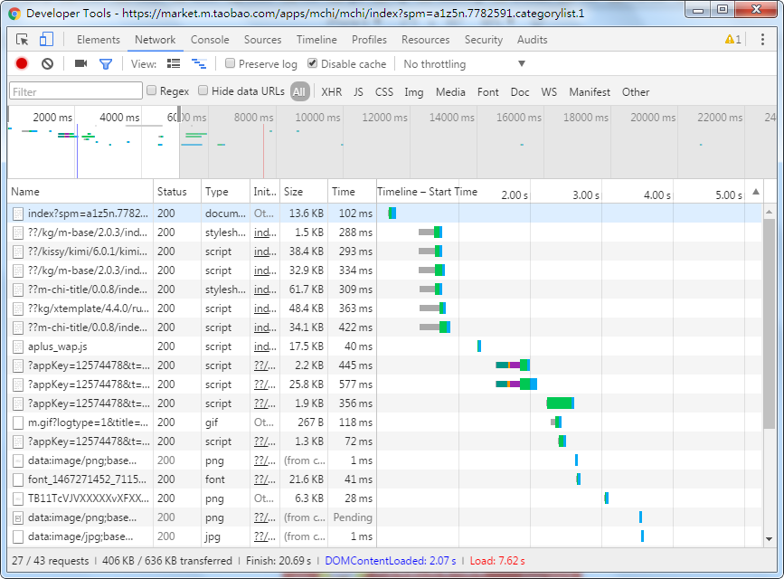

   禁用浏览器缓存 首屏首次访问，DOMContentLoaded, Load事件的时间见图，首字节时间 33ms

### 网络环境1 专题页DNS查找时间

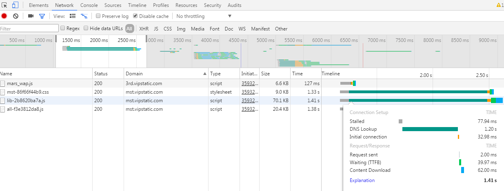

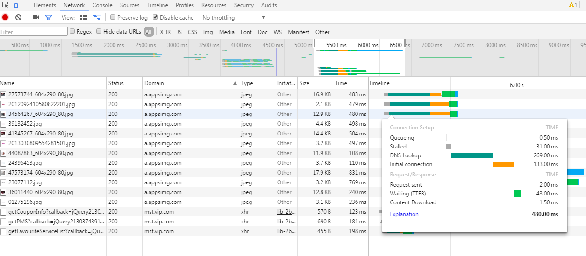

网络环境2(chrome模拟wifi)--页面加载时间
------------------
1. [专题1](http://mst.vip.com/356726.php)

   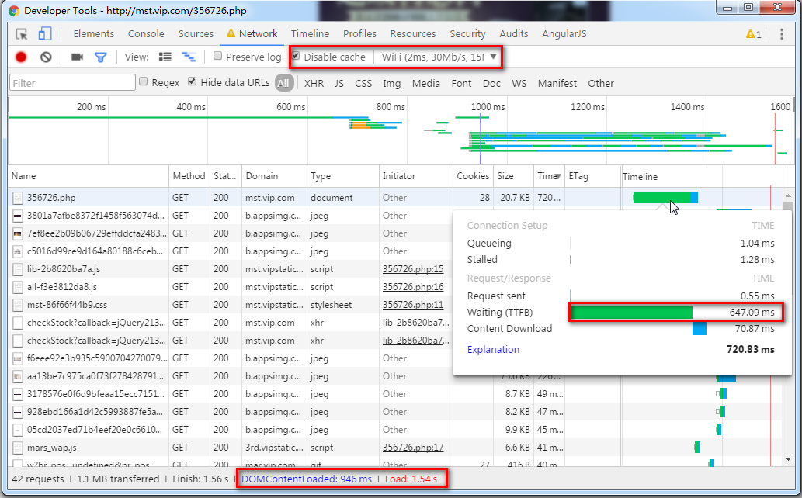

   禁用浏览器缓存 首屏首次访问，DOMContentLoaded, Load事件的时间, 首字节时间 见图

2. [专题2](http://mst.vip.com/359326.php)

   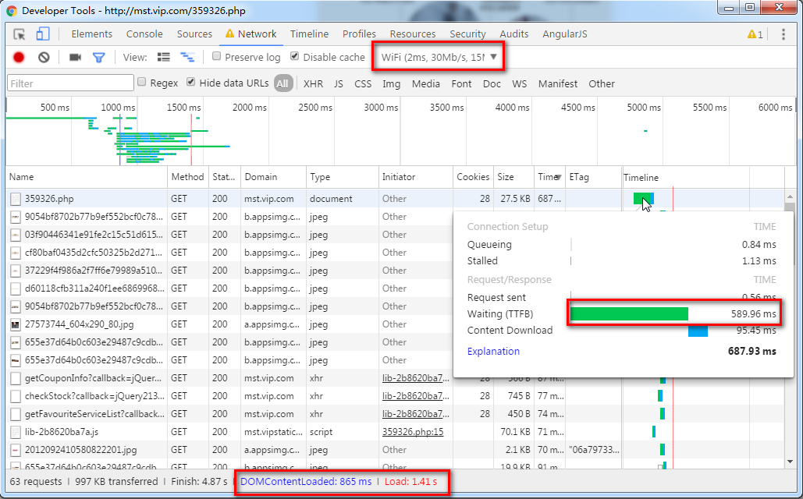

   禁用浏览器缓存 首屏首次访问，DOMContentLoaded, Load事件的时间 首字节时间 见图

3. [京东类专题页](http://sale.jd.com/m/act/kmRjHY1UNoPAagbL.html?share=yes&jd_pop=5f92bec2-c4df-49a4-8692-8cf3a6cc6419&abt=1)

   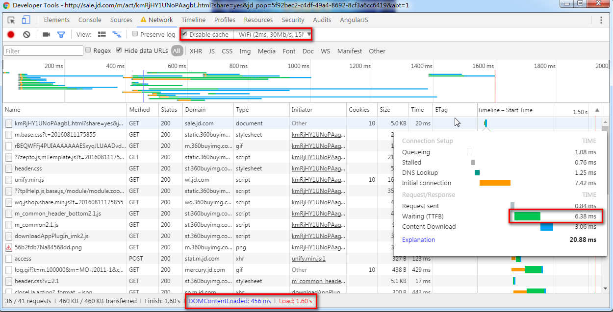

   禁用浏览器缓存 首屏首次访问，DOMContentLoaded, Load事件的时间见图，首字节时间 26ms

4. [淘宝类专题页](https://market.m.taobao.com/apps/mchi/mchi/index?spm=a1z5n.7782591.categorylist.1)   

   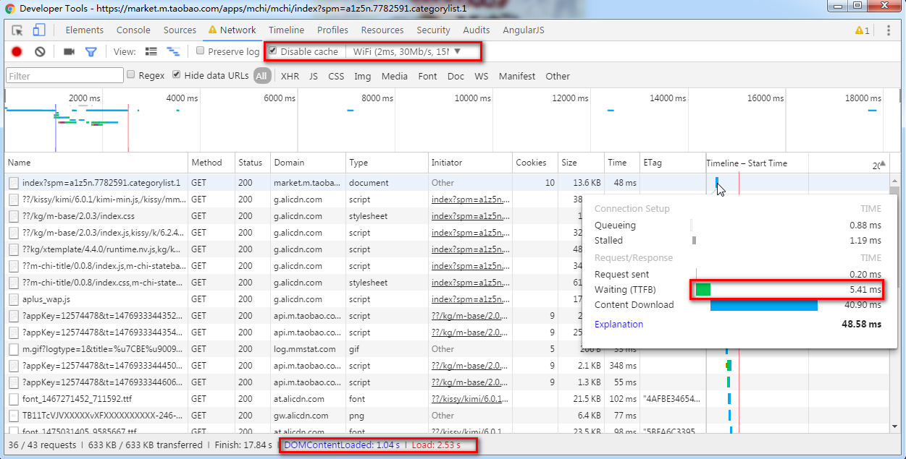

   禁用浏览器缓存 首屏首次访问，DOMContentLoaded, Load事件的时间见图，首字节时间 33ms

### 网络环境2 专题页DNS查找时间

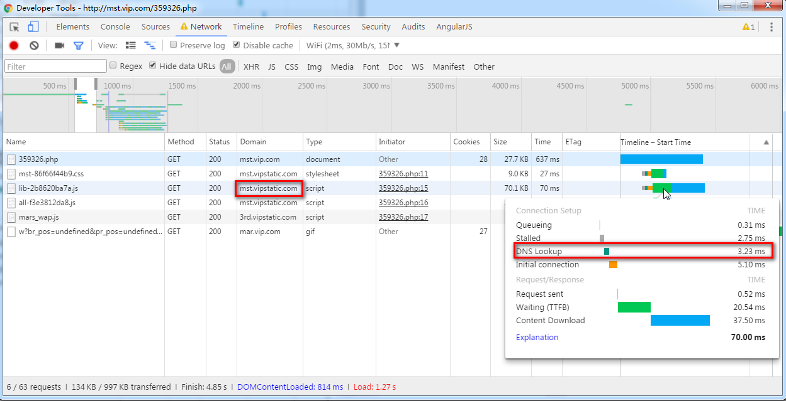

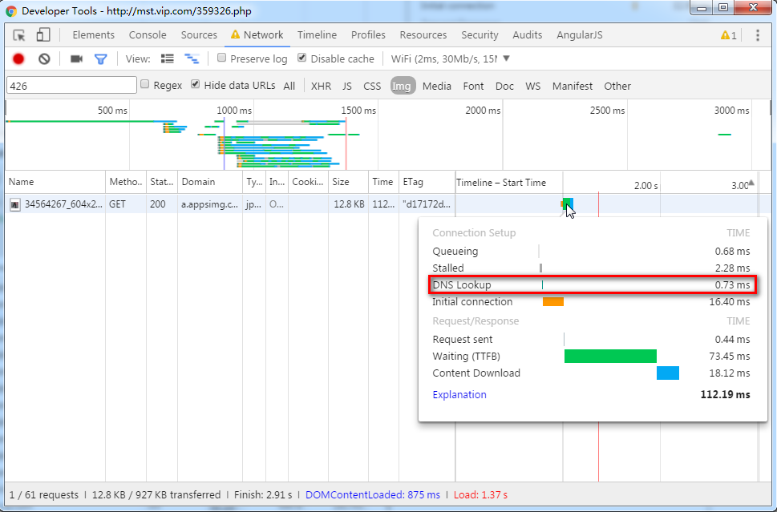

### 图片资源域少，请求等待

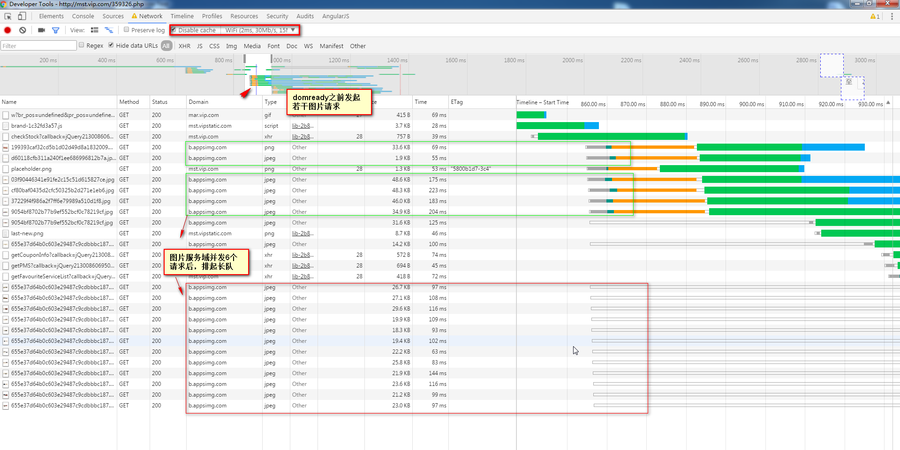

### 耗时分析

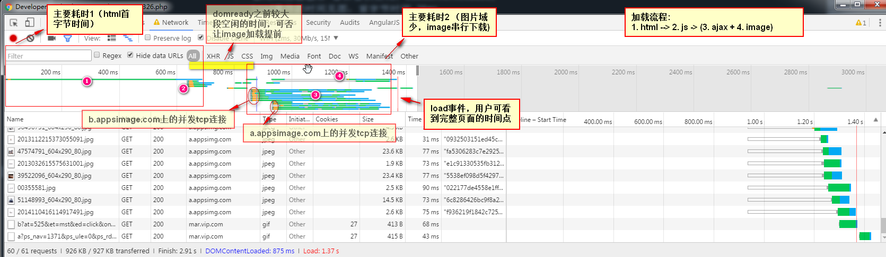

### 测试对比结果

1. **首字节时间优化**: html页面首字节时间较大，导致DOMContentLoaded的时间而言会比京东，淘宝慢不少。 *后端*
2. **增加图片域**: 图片资源域只有2个，导致请求并发少，后续请求只能串行
3. **图片优化**：静态资源大部分为图片, 可考虑优化图片大小和数量 (需加载的图片提前打印，提前加载, 不等待组件初始化才加载)
4. DNS预获取: 具体的网络环境下 DNS查找比较耗时，可尝试 meta dns-prefetch
5. JS请求合并：静态资源服务器能否合并多个请求(static.com/a.js?b.js -> ab.js)

优化方案
---------
1. **首字节时间**
   后端

2. **图片加载**
   + **增加图片域** 
      提高图片请求的并发数,减少图片请求排队的情况。目前档期图片域有2个(*a.appsimg.com, a.vimage1.com*), 专题上传图片域也有2个(*b.appsimg.com, b.vimage1.com*), 由于通常webkit内核浏览器单域名最大并发为6，暂定图片6个一组，交替使用不同域名; 上传的图片域名打散有后端处理，档期图片域名打散前端处理.
   + **提前请求图片**
      目前图片都是在JS加载完后才请求的, 后端将首屏的图片URL也打印出来，前端在加载JS前，先new Image()的方式请求图片, 让图片请求和JS请求并行
   + **上传JPG 压缩处理** 待定
      后台编辑页面时，上传未压缩的jpg图片，导致页面变大.
   + **webp图片格式** 参考
      webp在保证图片质量的情况下，图片大小比jpg更小，能提高传输速度，但客户端渲染时间会比jpg要稍长，目前图片服务器并不支持生成webp格式。
   + **响应式图片分辨率**
      根据用户手机分辨率的大小，采用对应大小的图片. `原有函数处理VIP.getClientImageSrc`
   + **渐进式图片** 参考
      渐进式图片从模糊到清晰的加载效果有更好的用户体验，但京东 淘宝的类似页面也无使用
   + **图片放到无cookie域**
      [placeholder.png](http://mst.vip.com/demo/image/placeholder.png) 和 [sale_out.png](http://mst.vip.com/demo/image/sale_out.png)两张图片最好能放到无cookie的静态域下，避免不必要的cookie发送, 减少请求数据量  
      > placeholder.png 写在 jquery.lazyload.js中, sale_out.png等图片写在组件的样式中，静态域(mst.vipstatic.com)中已有大多数图片，最好同步一下个别缺少的图.
   + **图片缓存设置**
      *b.appsimg.com*图片服务器，应为图片设置 max-age 或 expires 响应头。

3. **DNS预获取**
   一些网络环境下 DNS查找比较耗时，可尝试 meta dns-prefetch

4. **JS请求合并**
   静态资源服务器能否合并多个请求(http://my.com/??a.js?b.js -> ab.js) 忽略

5. 头图 倒计时 档期组件渲染优化  待定
   

